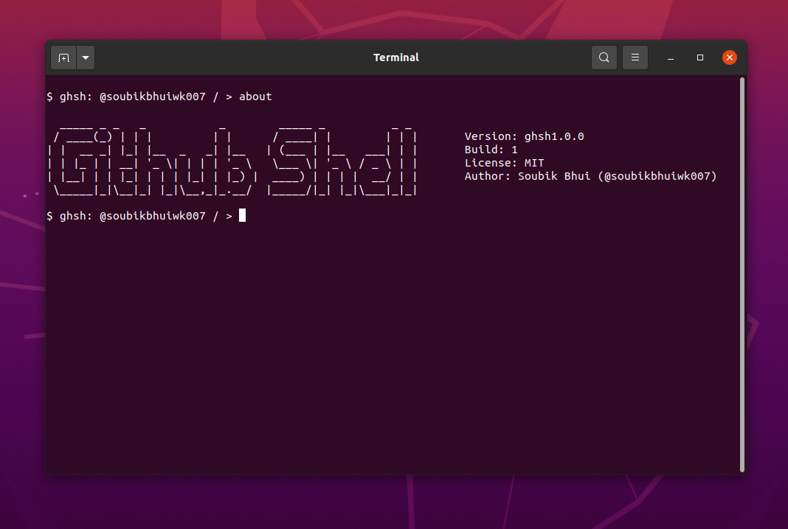

# GitHub Shell

<div align="center">

</div>

`ghsh` (or Github shell) is a command line tool available for windows, linux and macos that lets you use github as a shell. It is not another `github cli` ofc. It is extensible so you can easily create & add your own commands. You can go into specific folder and edit files right there. Ships only a single executable.

## Installation

There are several ways to install `ghsh`. You can also download the release binary from the [Release Page](https://github.com/soubikbhuiwk007/ghsh/releases/)

### Windows (Powershell)

```powershell
iex ((New-Object System.Net.WebClient).DownloadString('https://github.com/soubikbhuiwk007/ghsh/releases/download/v1.0.0/install.ps1'))
```

### Linux 

* Download the tar.gz file from Releases
* Extract the file.
* Open the `.bashrc` file in your `home` directory and add `export PATH="path/to/folder:$PATH"` to the last line of the file.
* Save the file & restart your terminal

### MacOS (darwin)

* Download the tar.gz file from Releases
* Extract the file.
* Open the `.bash_profile` file in your `home` directory and add `export PATH="path/to/folder:$PATH"` to the last line of the file.
* Save the file & restart your terminal

### Using Go sdk

```shell
go get -u github.com/soubikbhuiwk007/ghsh@latest
go install github.com/soubikbhuiwk007/ghsh@latest
```

## Get Started
Run the following to authorise `ghsh`
```shell
$ ghsh auth -login
```

Checkout the list of all the available [Commands](docs/COMMANDS.md) & the [Documentation](docs/README.md)

There are 2 ways to execute commands

* From command line arguments. You can run this from your terminal.

```shell
$ ghsh [command-name] [arguments...]
```

* Inside `ghsh`

```
$ ghsh: @username / > command-name [arguments...]
```

> Some Commands can only be used inside a repository

### **This Project licensed under [MIT](./LICENSE)**
