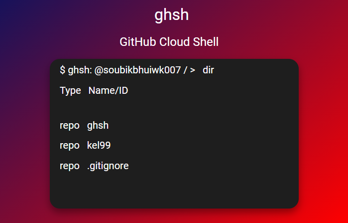

<div style="display:flex;">
     
    <h1 style="margin-left: 15px">Github Shell</h1>
</div>
<br>



`ghsh` (or Github shell) is a command line tool available for windows, linux and macos that lets you use github as a shell. It is not another `github cli` ofc. It is extensible so you can easily create & add your own commands. You can go into specific folder and edit files right there.

## Installation

### Using Go sdk

```shell
go install github.com/soubikbhuiwk007/ghsh/@latest
```

### Using Pre-Build Binaries

|OS|Architecture|File|
|:-:|:---------:|:--:|
|`windows`|`amd64`||

## Get Started
Run the following to authorise `ghsh`
```shell
$ ghsh auth -login
```

